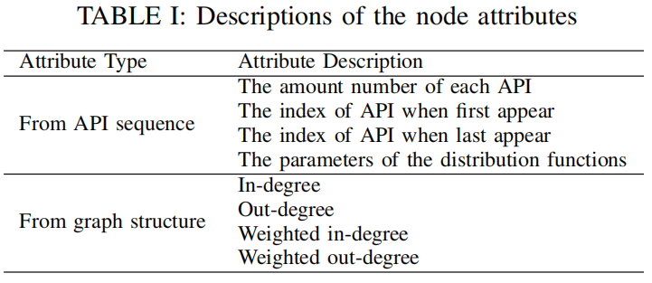
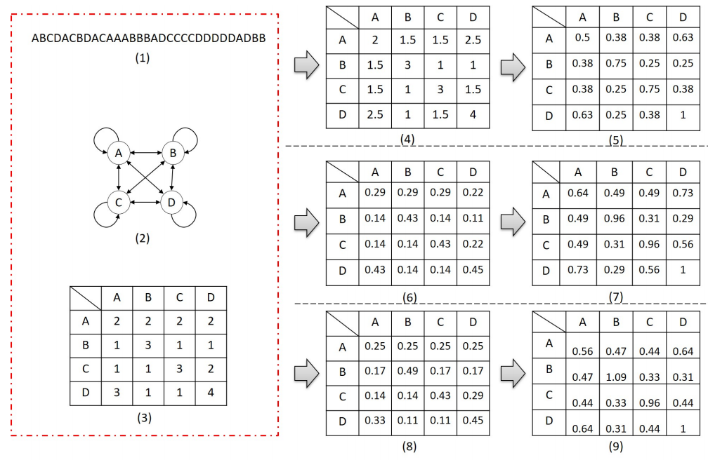
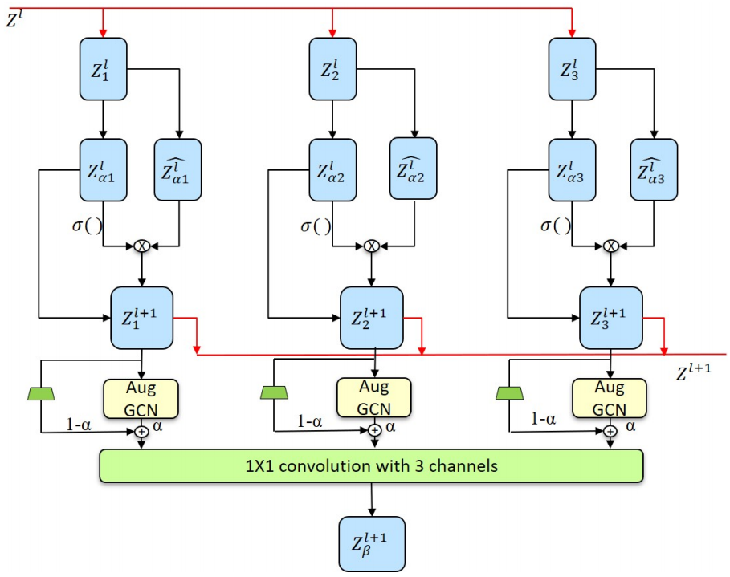
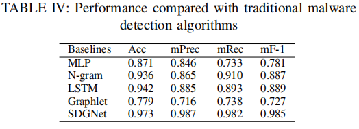
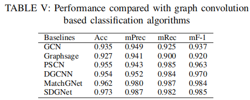
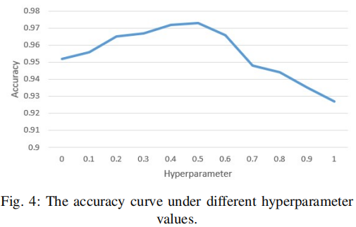
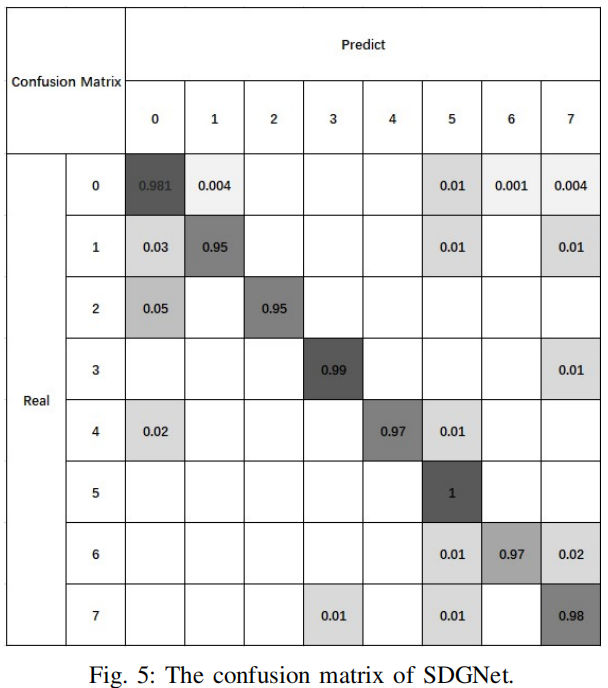
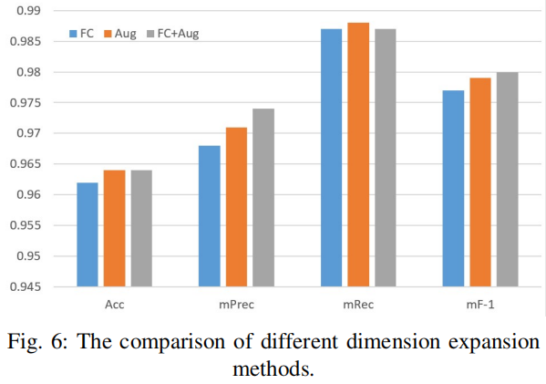

# 基于谱域有向图网络的恶意软件检测方法

## 1、背景

### 1.1、刊物/会议级别

IEEE TNSE.2020.3024557

### 1.2、作者团队

hidden

### 1.3、论文背景

基于谱域的深度学习方法作为一种基于行为特征的恶意软件检测方法，随着恶意威胁的快速增长，吸引了大量的研究工作。然而，由于图邻接矩阵的不对称性，以往基于谱域的图神经网络很难应用于有向图。为了解决现存的问题，作者提出了一种基于谱域的有向图网络(SDGNet)结构来对有向图进行分类。

为了解决有向图在谱域的应用问题，作者应用三种归一化(normal, aggregation and propagation)方法将不对称的图邻接矩阵转化为对称图矩阵。然后，作者提出了利用门控机制，augment GCN和全连接层的MDGCN，它完整连接了三个归一化的对称图矩阵，并生成相应的综合结点嵌入信息，将结点嵌入信息融合后得到相应的图表示。将每个MDGCN层的图表示连接在一起后，使用组合损失函数对恶意软件进行分类，以进一步提高性能。

## 2、论文主要方法

### 2.1、SDGNet

#### 2.1.1 API Graph Modeling

API调用表示程序是一种通用的恶意软件检测方法，因为它不包含硬件平台信息和编程语言信息。API之间的交互很容易被监视和收集并得到API序列。要使用API之间的结构依赖关系，我们可以将API序列转换为图。形式上，给定一个API序列$S$，每个软件都可以表示为图$G=(V,E)$，其中$V$表示结点集，$E$表示边集。 每个结点表示一种API，每条边表示API之间的连接关系。我们将每个API结点的属性向量定义为$x$，并将属性矩阵定义为$X$。有$n$个结点图$G$的邻接矩阵定义为$A\in \Zeta^{n\times n}$，因为是有向图所以它是一个不对称矩阵。

在本文中，我们实现了两种类型的属性作为结点属性，如下表所示。

有以下两类属性：

* API序列
  * API序列中每种API（该结点）的出现次数
  * API（该结点）第一次出现在API序列中的索引(index)
  * API（该结点）最后一次出现在API序列中的索引(index)
  * API序列中API（该结点）的概率密度分布函数的参数
* 图结构
  * 图中该结点的入度
  * 图中该结点的出度
  * 图中该结点的加权入度（平均值、最大值、最小值）
  * 图中该结点的加权出度（平均值、最大值、最小值）

#### 2.1.2 Weighted Graph Matrix Normalization（加权图矩阵归一化）

因为有向图邻接矩阵$A$是不对称的，通常可以直接使用公式$A'=\frac{1}{2}(A+A^T)$得到对称的归一化拉普拉斯矩阵$A'$，但是这会丢失结点间的部分信息。所以作者提出三种将其转化为对称矩阵的方法。

* Normal Normalization

直接将各边权重缩放到[0,1]，得到$A_1''$。

$$
A' = \frac{1}{2} (A+A^T) \\
(A_1'')_{ij} = \frac{A'_{ij}}{max(A')}
$$

* Aggregation based Normalization

基于聚合的归一化聚合了可达结点的信息。该方法捕获结点(API)之间的一些详细的交互聚合特征，也可以说聚合了结点的方向信息，即列归一化，得到$A_2''$。

$$
(A_2)_{ij} = \frac{A_{ij}}{\sum_{j} A_{ij}} \\
A_2' = \frac{1}{2} (A_2+A_2^T) \\
(A_2'')_{ij} = \frac{(A_2')_{ij}}{max(A_2')}
$$

* Propagation based Normalization

基于传播的归一化捕获结点(API)之间的一些详细交互传播特征，它考虑图结点之间的转移概率，即行归一化，得到$A_3''$。

$$
(A_3)_{ij} = \frac{A_{ij}}{\sum_{i} A_{ij}} \\
A_3' = \frac{1}{2}(A_3+A_3^T) \\
(A_3'')_{ij} = \frac{(A_3')_{ij}}{max(A_3')}
$$

这三种邻接矩阵生成生成过程可以看下图例子，(5)、(7)、(9)分别为Normal、Aggregation、Propagation生成的邻接矩阵。

#### 2.1.3 Different layers of MDGCN

MDGCN网络结构如下图，它由结点特征学习、结点特征维度扩展和图表示学习三部分。

* Naive directed GCN

对给定的归一化对称矩阵$A_1''$，$A_2''$和$A_3''$，作者对它们使用图卷积技术获得相应的结点嵌入信息。递归方程如下：
$$
Z_k^{l+1}=f(\tilde{D_k}^{-\frac{1}{2}}\tilde{A_k}\tilde{D_k}^{-\frac{1}{2}}Z_k^lW_k^l); Z_k^0=X
$$
其中第$l$层输入为$Z_k^l$，参数为$W_k^l$，$\tilde{A_k}=A_k''+I$，图$G$的增广对角度为$D_{kii}=\sum_j\tilde{A}_{kij}$。

第$l$层的结点嵌入信息可以使用公式$A'=\frac{1}{2}(A+A^T)$学习并表示为$Z_1^l$，$Z_2^l$，$Z_3^l$。 然后，为了从结点嵌入中得到一个全面的图表示，我们可以将它们与加权参数结合起来。第$l$层融合后输出的图表示的计算如下：
$$
Z^l=W_1^lZ_1^l+W_2^lZ_2^l+W_3^lZ_3^l
$$
其中为$W_1^l$，$W_2^l$，$W_3^l$为混合图表示的权重参数。

* Augment GCN

一般基于图的方法检测恶意软件会存在两个问题：首先，API类型数量很大，但单个软件的API类型数量一般来说很少，这使得图特征矩阵是一个很大的稀疏矩阵；其次，图中各个API结点的重要性不一致，在某一个软件中有的API会被频繁调用而有的API却很少被调用。作者将两个问题归为欠拟合(underfitting)。

为解决这种欠拟合问题，作者提出一种增强GCN，利用图结构信息扩展结点的嵌入维数。给定结点嵌入矩阵$Z_{in}\in R^{N\times F1}$，增强GCN的目标则是生成增强结点嵌入矩阵$Z_{out}\in R^{N\times F2}(F2>F1)$，它用于融合全面的图表示，公式如下：
$$
Z_{out}=f(\tilde{D_k}^{-\frac{1}{2}}\tilde{A_k}\tilde{D_k}^{-\frac{1}{2}}Z_{in}W_{aug})
$$
其中$\tilde{A_k}=A_k''+I$，图$G$的增广对角度为$ D_{kii} = \sum_{j} \tilde{A} _{kij} $，增强参数$W_{aug} \in R^{F1 \times F2}$。

* Network of MDGCN

作者利用所提出的naive directed GCN和gated convolutional neural network，提出了更好提取特征的MDGCN。

对于MDGCN的$l+1$层，该层的输入特征向量为$Z_1^l$，$Z_2^l$，$Z_3^l$。参考公式$Z_k^{l+1}=f(\tilde{D_k}^{-\frac{1}{2}}\tilde{A_k}\tilde{D_k}^{-\frac{1}{2}}Z_k^lW_k^l)$但不共享权值，我们可以得到$Z_{\alpha 1}^l$和$\hat{Z} _{\alpha 1} ^l$，$Z_{\alpha 2}^l$和$\hat{Z} _{\alpha 2} ^l$，$Z_{\alpha 3}^l$和$\hat{Z} _{\alpha 3} ^l$。然后，为了获取带注意力的结点特征，用以下公式获取新的结点嵌入特征：

$$
Z_1^{l+1} = Z_{\alpha 1}^l + (\hat{Z} _{\alpha 1} ^l \bigotimes \sigma(Z_{\alpha 1}^l)) \\
Z_2^{l+1} = Z_{\alpha 2}^l + (\hat{Z} _{\alpha 2} ^l \bigotimes \sigma(Z_{\alpha 2}^l)) \\
Z_3^{l+1} = Z_{\alpha 3}^l + (\hat{Z} _{\alpha 3} ^l \bigotimes \sigma(Z_{\alpha 3}^l))
$$

其中$\bigotimes$为哈达玛积，$\sigma()$是sigmoid函数，用于获得带注意力的结点嵌入。

在计算这些结点嵌入特征后，我们需要将它们融合在一起，以获得更全面的图特征。使用全连接层去扩展维度，我们可以得到增强结点嵌入$Z_{out1}$，它侧重于直接建立原始结点的信息。同时，使用Augment GCN，我们可以得到另一种增强结点嵌入$Z_{out2}$，它侧重于图结构中邻接结点特征的影响。通过使用参数$\alpha$将$Z_{out1}$和$Z_{out2}$结合，我们可以得到最终结点嵌入$Z_f$：

$$
Z_f=(1-\alpha)Z_{out1}+\alpha Z_{out2}
$$
在扩展维度后，我们可以得到第$l+1$层的三种不同方面的结点嵌入$Z_{f1}^{l+1}$，$Z_{f2}^{l+1}$，$Z_{f3}^{l+1}$。然后，使用$1×1$卷积层将它们融合在一起。最后，我们可以得到MDGCN的第$l+1$层的输出图表示$Z_{\beta}^{l+1}$。

#### 2.1.4 Classification

分类时，利用CNN提取降维后，将输出图表示flatten，并将其输入三层全连接的神经网络中。 总损失为：

$$
Loss=(1-\lambda)L_c + \lambda L_{gf}
$$
其中$L_c$是分类损失，$L_{gf}$是图特征损失，来自于MDGCN的第一层和最后一层输出矩阵的相似度差。

* 分类损失

交叉损失作为分类所示。对于N个样本的K类分类任务，分类损失为：

$$
L_c (Y,P)=\frac{1}{N} \sum_{i=0}^{N-1} \sum_{k=0}^{K-1} y_{i,k} log p_{i,k}
$$

其中$Y$是ground truth，$P$是预测结果。

* 图特征损失

 为了训练3层MDGCNs以获得更好的分类性能，作者使用图特征损失作为一种正则化方法。

$$
L_{gf} (Y,P)=\frac{1}{N} \sum_{i=0}^{N-1} \sum_{j=0}^{J-1} f(x)sigmoid(log(\frac{|d_{i,j}\cdot m_{i,j}|}{|d_{i,j}|\cdot |m_{i,j}|})) \\
f(x) = \begin{cases} 
-1,  & \mbox{if } y_{i,k}=\bar{p}_{i,k}; \\
+1, & \mbox{otherwise}
\end{cases} \\
\bar{p}_{i,k}=k, p_{i,k} \mbox{is the biggest in } p_i \mbox{.}
$$

其中$d_{i,j}$代表第$i$个样本在MDGCN第1层的输出图表示$Z_{\beta}^{1}$的第$j$维结点特征向量，$m_{i,j}$代表第$i$个样本在MDGCN第3层的输出图表示$Z_{\beta}^{3}$的第$j$维结点特征向量。

## 3、实验

### 3.1 实验设置

* 数据来源：
  * [阿里云安全恶意程序检测](https://tianchi.aliyun.com/competition/entrance/231694)
  * 数据集是沙箱模拟执行windows可执行程序文件中的API指令序列。阿里数据集包含8909个标记样本，有6亿个API记录。软件样本的类型可分为8类：{正常软件，勒索软件，挖矿软件，DDoS，蠕虫，病毒，后门，木马}，API类型总数为295种。
  * 在作者的实验中，重建了一个平衡的数据集。正常软件与恶意软件的样本比例为1：1，每个恶意软件具有相同的样本数量。由于蠕虫在阿里数据集中只有100个样本，因此所有恶意软件类型都有100个样本，而正常软件在重建数据集中有700个样本。
  * 值得注意的是，API执行序列可能包含许多线程的执行结果，但通过图表示连接后， 具有多个线程的软件的检测方式与只有一个线程的软件相同。

* 模型训练与评估
  * 200 epochs，五折，每个epoch训练：验证：测试=3：1：1。
  * 评估指标：accuracy，micro-recall，micro-precision，micro-F-1 score。

* Baselines
  * 使用SDGNet（超参数$\lambda$设置为5）与其他恶意软件检测算法和图分类算法比较：
    * 传统恶意软件检测算法：MLP、N-gram、LSTM、Graphlet
    * 图卷积分类算法：GCN、Graphsage、PSCN、DGCNN、MatchGNet

### 3.2 实验结果

#### 3.2.1 与其他传统恶意软件检测算法比较

SDGNet的Acc最高0.973，也比其它算法有更小的假阳率和假阴率，mF-1分数也是最高，基本上可以说作者的方法在很大程度上优于传统的恶意软件分类算法。因为SDGNet可以学习更多的鉴别表示（特别是深层结构特征）。对于传统恶意软件分类算法的结果，N-gram和LSTM的结果优于其他两种算法。这表明API结点在序列的顺序和结点之间的关系是检测（分类）恶意软件的关键。

#### 3.2.2 与其他图卷积分类算法比较

SDGNet的Acc、mPrec和mF-1依旧最高，也就是说与其他基于图卷积的分类算法相比，作者的方法可以获得更高的性能。其中MDGCN和MatchGNet表现比GCN、PSCN、DGCNN和Graphsage，这说明多跳邻居的特征聚合有利于提高分类精度。

#### 3.2.3 超参数选择

SDGCN的损失函数中使用超参数$\lambda$，下图为它的值与accuracy的关系：

当$\lambda$是0时，只有分类损失，acc为0.952；当$\lambda$是1时，只有图特征损失，acc为0.927。当$\lambda$在0.1到0.4区间时，分类损失权重比图特征损失权重大，分类acc随$\lambda$增大逐渐增高；当$\lambda$在0.6到0.9区间，图特征损失权重比分类损失权重小，分类acc随$\lambda$增大逐渐减小。当$\lambda$为0.5时，两者损失权重相等，得到最高的分类acc。这说明添加了适当的图特征损失可以提升恶意软件分类性能。

#### 3.2.4 不同类别恶意软件分类结果

{0：正常软件，1：勒索软件，2：挖矿软件，3：DDoS，4：蠕虫，5：病毒，6：后门，7：木马}

在归一化混淆矩阵中，从每种恶意软件之间的比较中得到了两个观察结果：

1. SDGNet在DDoS、病毒和木马上的分类性能优于其他分类，在后门上的分类性能是所有类别中最差的。
2. 所有DDoS、病毒、后门和木马都被检测为恶意软件。但是，许多挖矿软件（占所有挖矿恶意软件的5%）被检测为正常软件，这是MDGNet的弱点。3%的挖矿恶意软件和2%的蠕虫被检测为正常软件，应加以改进。

#### 3.2.5 模型简化实验（Ablation Studies）

> SDGNet不同组件的影响

四大组件：

* MF：融合结点嵌入的多个方面特征的特征融合组件
* LC：连接不同层的图表示的特征连接组件
* CN：为分类降维图表示的特征提取和降维组件
* GL：图特征损失

“LC+MF+CN+GL”整体表现(mF-1)比“LC+MF+CN”差，表明附加的图特征损失可以提高分类精度性能，但会削弱召回性能。

对“LC+MF+CN”和“LC+MF”的比较表明，连接不同层图表示后的降维可以提高分类性能。

“LC+MF+CN”和“MF+CN”之间的比较表明，不同层的图表示的特征级联可以显著提高分类器的性能。

对“LC+MF”和“LC”的比较表明，不同层图表示的特征融合可以显著提高分类性能。

> MDGCN不同组件的影响

前三项的比较表明融合结点嵌入的不同方面之前的维数扩展可以提高分类的性能，具有结构信息的维数扩展可以进一步提高性能。

对“Gate”和“naive GCN”的比较表明，采用门控机制的结点嵌入特征提取可以提高分类性能。然而，使用门控机制会使假阳率增加，这主要是因为门控机制通过动态加权图上的结点来概括全局特征。全局特征有助于识别恶意软件，而局部特征有助于识别良性软件。

> augment GCN的影响

与“FC”和“Aug”相比，“FC+Aug”达到了最高的准确率。这一结果表明，“Aug”捕获的结构信息更有助于提高分类算法的准确率。

与“FC”和“Aug”相比，“FC+Aug”具有最高的微精度值。这一结果表明，“Aug”捕获的结构信息更有助于提高分类算法的精度。

与“FC”和“Aug”相比，“Aug”具有最高的微召回率。这一结果表明，将“Aug”和“FC”捕获的信息融合在一起对识别恶意软件无帮助。

 与“FC”和“Aug”相比，“FC+Aug”具有最高的微F-1值。由于“FC+Aug”的整体性能较好，本文选择了这种结构来扩展结点嵌入维数。

## 4、总结与研究启发

把API序列转化为有向图来解决恶意软件检测的问题，方法很新颖，唯一要担心的可能就是0day攻击和对抗性问题。训练集中的数据，例如API类型，是否能泛化到真实情况下。以及针对图网络的对抗攻击，例如增删结点或边，是否会影响检测结果。这些都需要未来做验证。

最后不知道图中是否能再细化以下结点和边的属性。例如对于结点来说，有一些API是专门针对文件的操作；对于边来说，邻接API结点间调用所用时间的大小等等。