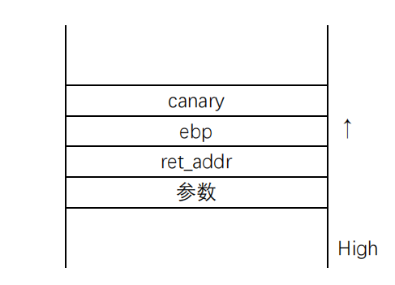
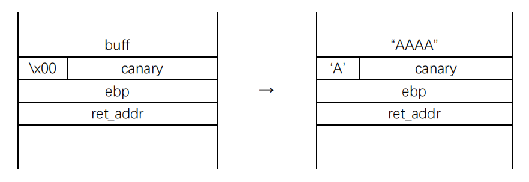
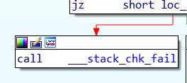

# canary笔记

## 布局



## more

### 直接泄漏

因为canary最低字节必是`'\x00'`(防止填满把它打印出来)，则满足下面条件：
> * 缓冲区溢出可以填充到且只填充到canary最低字节
> * 程序可以输出填充的内容
> * 函数返回前还有再次填充机会



这样就可以读出canary后再把它加到payload上，从而绕过canary。

### 格式化字符串

格式化字符串能够实现任意地址读写的特性，可以读出canary或修改cannary执行`___stack_chk_fail()`，具体用法：[格式化字符串笔记](http://yurixo.top/2018/03/29/%E6%A0%BC%E5%BC%8F%E5%8C%96%E5%AD%97%E7%AC%A6%E4%B8%B2%E7%AC%94%E8%AE%B0/)。

### 爆破

若程序有`fork()`使子程序循环执行，可以通过子程序栈与主程序一致慢慢爆破。

### ssp leak

因为函数返回前会检查canary，若不通过会跳转到`___stack_chk_fail()`：



因此可以通过修改`___stack_chk_fail()`地址和覆盖canary来劫持程序流程，但这里也有一种可以利用的东西：

看一下源码：
`__stack_chk_fail`:

```C
void 
__attribute__ ((noreturn)) 
__stack_chk_fail (void) {   
	__fortify_fail ("stack smashing detected"); 
}
```

`fortify_fail`:

```C
void 
__attribute__ ((noreturn)) 
__fortify_fail (msg)
   const char *msg; {
      /* The loop is added only to keep gcc happy. */
         while (1)
              __libc_message (2, "*** %s ***: %s terminated\n", msg, __libc_argv[0] ?: "<unknown>") 
} 
libc_hidden_def (__fortify_fail)
```

`__libc_message` 的第二个%s输出的是`argv[0]`，`argv[0]`是指向第一个启动参数字符串的指针,由此我们可以通过缓冲区溢出覆盖掉`argv[0]`打印我们想要的地址上的值。