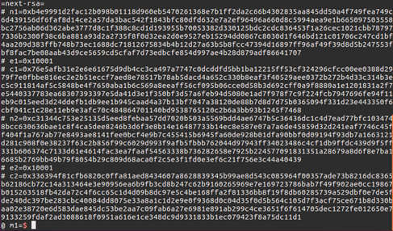

# nextrsa

-----

## 第一关


因为n的位数较低，所以可以直接用factor.db分解

-----

## 第二关


可以发现e和n相差无几，则d就应当很小，适合Wiener's Attack攻击

-----

## 第三关


Coppersmith有一个相关已知明文高位的套路，根据其套路可以写脚本跑出x:

```sage
from sage.all import *
import binascii

def coppersmith_howgrave_univariate(pol, modulus, beta, mm, tt, XX):
    """
    Coppersmith revisited by Howgrave-Graham
    
    finds a solution if:
    * b|modulus, b >= modulus^beta , 0 < beta <= 1
    * |x| < XX
    """
    #
    # init
    #
    dd = pol.degree()
    nn = dd * mm + tt

    #
    # checks
    #
    if not 0 < beta <= 1:
        raise ValueError("beta should belongs in (0, 1]")

    if not pol.is_monic():
        raise ArithmeticError("Polynomial must be monic.")

    #
    # calculate bounds and display them
    #
    """
    * we want to find g(x) such that ||g(xX)|| <= b^m / sqrt(n)
    * we know LLL will give us a short vector v such that:
    ||v|| <= 2^((n - 1)/4) * det(L)^(1/n)
    * we will use that vector as a coefficient vector for our g(x)
    
    * so we want to satisfy:
    2^((n - 1)/4) * det(L)^(1/n) < N^(beta*m) / sqrt(n)
    
    so we can obtain ||v|| < N^(beta*m) / sqrt(n) <= b^m / sqrt(n)
    (it's important to use N because we might not know b)
    """

    
    #
    # Coppersmith revisited algo for univariate
    #

    # change ring of pol and x
    polZ = pol.change_ring(ZZ)
    x = polZ.parent().gen()

    # compute polynomials
    gg = []
    for ii in range(mm):
        for jj in range(dd):
            gg.append((x * XX)**jj * modulus**(mm - ii) * polZ(x * XX)**ii)
    for ii in range(tt):
        gg.append((x * XX)**ii * polZ(x * XX)**mm)
    
    # construct lattice B
    BB = Matrix(ZZ, nn)

    for ii in range(nn):
        for jj in range(ii+1):
            BB[ii, jj] = gg[ii][jj]


    # LLL
    BB = BB.LLL()

    # transform shortest vector in polynomial    
    new_pol = 0
    for ii in range(nn):
        new_pol += x**ii * BB[0, ii] / XX**ii

    # factor polynomial
    potential_roots = new_pol.roots()
    print "potential roots:", potential_roots

    # test roots
    roots = []
    for root in potential_roots:
        if root[0].is_integer():
            result = polZ(ZZ(root[0]))
            if gcd(modulus, result) >= modulus^beta:
                roots.append(ZZ(root[0]))

    # 
    return roots

length_N = 512
Kbits = 64
N = 85386486679828599580613066311269711214589585481101615581296927592958807231446970184482261388474676486050444822516280749509523758510668655773404480913269316295175308996609608070541200210554579418533451998222898737697148663794221042817919855879902993658181608937735268591691305164506461133402548866059191941933L
e = 3
C = 39405977400432024095329579138777905592731613749623714143014800208080426514337386767953501370330051575213583063517497523787104967672473851683888736374797826583547420259646720505700192827892104650587073833929922367521346003590720815367916103365434959190063774892078125987148203790224964513136099494214652877100L
b = 0xfedcba98765432100000000000000000000000000000000000000000000000000000000000000000000000000000000000000000000000000000000000000000

P.<x> = PolynomialRing(Zmod(N))

f = (b + x)^e - C
dd = f.degree()
beta = 1
epsilon = beta / 7
mm = ceil(beta**2 / (dd * epsilon))
tt = floor(dd * mm * ((1/beta) - 1))
XX = ceil(N**((beta**2/dd) - epsilon))
roots = coppersmith_howgrave_univariate(f, N, beta, mm, tt, XX)
print "\n# Solutions"
print "we found:", str(roots)
```

-----

## 第四关


-----

## 第五关


把n尝试分解可知n含有一个小因数，但是这个n是隔一段时间（不是每一次）会变的，不过含小因数的性质不变，所以每次到这里先分解吧

-----

## 第六关


可以直接看到e=0x3很小，估计就是爆破c+i*n中的i使其能被e开根，事实证明确实大概几万就出来了

-----

## 第七关



光看上去是没什么思路，但求gcd(n1,n2)不等于1，则可直接分解这两个n

-----

## 第八关


挺明显的共模攻击

-----

## 第九关


也是很明显的广播攻击，e很小且明文相同，话说越到后面越简单么

-----

## 脚本

```python
# -*- coding: utf-8 -*-

from pwn import *
from mylib import *
import hashlib
import gmpy

#context.log_level = "debug"

def before():
    token = "icq850a27bc1dc210c9e10cc8d1ed28f"
    r = remote('39.107.33.90',9999)
    r.sendline(token)
    r.recvuntil('\'')
    value = r.recv(8)
    r.recvuntil('=')
    for a in xrange(0xff):
            for b in xrange(0xff):
                    for c in xrange(0x1f):
                            hashv = chr(a) + chr(b) + chr(c)
                            if(hashlib.sha256(hashv).hexdigest()[0:8] == value):
                                    r.sendline(hashv.encode('hex'))
                                    return r

def solve(r):
    """
    位数少,可直接分解
    """
    r.recvuntil('c=')
    c = int(r.recvuntil('\n').replace("\n",""),16)
    r.recv(10000)
    e = 0x10001
    p = 289540461376837531747468286266019261659
    q = 306774653454153140532319815768090345109
    n = p * q
    ph = (p - 1) * (q - 1)
    d = gmpy.invert(e, ph)
    m = QuickPower(c, d, n)
    r.sendline(hex(m).replace("L",""))
    """
    Wiener's Attack
    """
    r.recvuntil('n=')
    n = int(r.recvuntil('\n').replace("\n",""),16)
    r.recvuntil('e=')
    e = int(r.recvuntil('\n').replace("\n",""),16)
    r.recvuntil('c=')
    c = int(r.recvuntil('\n').replace("\n",""),16)
    r.recv(10000)
    d = hack_RSA(e,n)
    m = QuickPower(c, d, n)
    r.sendline(hex(m).replace("L",""))
    """
    Coppersmith
    """
    r.recvuntil('m')    #10000 wrong
    x = 3704324190009897835
    r.sendline(hex(x).replace("L",""))
    """
    nextprime()性质构造一元二次方程求根
    """
    r.recvuntil('c=')
    c = int(r.recvuntil('\n').replace("\n",""),16)
    r.recv(10000)
    e = 0x10001
    q = 114791494681514143990268371423282183138226784645868909558224024738011633713833580549522009721245299751435183564384247261418984397745114977301564583085777881485180217075670585703780063072373569054286277474670485124459902688373648390826470893613150198411843162021692225644621249349903453125961550887837378298881
    p = 132940802289018336261987415312533953042764596984032548157327529495089307889127354914528507277209940457450746338751400025568015673025956762534143027257695791611900765053802453566263676389771478041671317414828940200119172760057249923066534954345956113954028278683477795444749575874548525999126508093286460575953
    n = q * p
    ph = (p - 1) * (q - 1)
    d = gmpy.invert(e, ph)
    m = QuickPower(c, d, n)
    r.sendline(hex(m).replace("L",""))
    """
    n含有小因数,过段时间会改变n
    """
    r.recvuntil('c=')
    c = int(r.recvuntil('\n').replace("\n",""),16)
    r.recv(10000)
    e = 0x10001
    q = 1827078707
    p = 120393827811847730665892922601047874074897457839754965824187553709286586875999984122668238470178081377988439748992735957987417809407665405412580451688753139556272709693049760814986485709769800614157806922562929660004878835280427602632657375319022388348710785821982994403660254841027504457789884082670526620753
    n = p * q
    ph = (p - 1) * (q - 1)
    d = gmpy.invert(e, ph)
    m = QuickPower(c, d, n)
    r.sendline(hex(m).replace("L",""))
    """
    e为小指数
    """
    r.recvuntil('n=')
    n = int(r.recvuntil('\n').replace("\n",""),16)
    r.recvuntil('c=')
    c = int(r.recvuntil('\n').replace("\n",""),16)
    r.recv(10000)
    e = 0x3
    for i in xrange(1000000):
        mm = gmpy.root(c+i*n, e)
        if(mm[1] == 1):
        r.sendline(hex(mm[0]).replace("L",""))
        break
    """
    两个n不互素
    """
    r.recvuntil('n1=')
    n1 = int(r.recvuntil('\n').replace("\n",""),16)
    r.recvuntil('c1=')
    c1 = int(r.recvuntil('\n').replace("\n",""),16)
    r.recvuntil('n2=')
    n2 = int(r.recvuntil('\n').replace("\n",""),16)
    r.recvuntil('c2=')
    c2 = int(r.recvuntil('\n').replace("\n",""),16)
    r.recv(10000)
    e1 = e2 = 0x10001
    p1 = gmpy.gcd(n1,n2)
    q1 = n1 / p1
    ph1 = (p1 - 1) * (q1 - 1)
    d1 = gmpy.invert(e1, ph1)
    m1 = QuickPower(c1, d1, n1)
    r.sendline(hex(m1).replace("L",""))
    r.recv(10000)
    q2 = n2 / p1
    ph2 = (p1 - 1) * (q2 - 1)
    d2 = gmpy.invert(e2, ph2)
    m = QuickPower(c2, d2, n2)
    r.sendline(hex(m).replace("L",""))
    """
    共模
    """
    r.recvuntil('n=')
    n = int(r.recvuntil('\n').replace("\n",""),16)
    r.recvuntil('e1=')
    e1 = int(r.recvuntil('\n').replace("\n",""),16)
    r.recvuntil('c1=')
    c1 = int(r.recvuntil('\n').replace("\n",""),16)
    r.recvuntil('e2=')
    e2 = int(r.recvuntil('\n').replace("\n",""),16)
    r.recvuntil('c2=')
    c2 = int(r.recvuntil('\n').replace("\n",""),16)
    r.recv(10000)
    gcd,s,t = gmpy.gcdext(e1,e2)
    if s < 0:
        s = -s
        c1 = gmpy.invert(c1, n)
    if t < 0:
        t = -t
        c2 = gmpy.invert(c2, n)
    m = (QuickPower(c1, s, n) * QuickPower(c2, t, n)) % n
    r.sendline(hex(m).replace("L",""))
    """
    广播攻击
    """
    r.recvuntil('e=')
    e = int(r.recvuntil('\n').replace("\n",""),16)
    r.recvuntil('n1=')
    n1 = int(r.recvuntil('\n').replace("\n",""),16)
    r.recvuntil('c1=')
    c1 = int(r.recvuntil('\n').replace("\n",""),16)
    r.recvuntil('n2=')
    n2 = int(r.recvuntil('\n').replace("\n",""),16)
    r.recvuntil('c2=')
    c2 = int(r.recvuntil('\n').replace("\n",""),16)
    r.recvuntil('n3=')
    n3 = int(r.recvuntil('\n').replace("\n",""),16)
    r.recvuntil('c3=')
    c3 = int(r.recvuntil('\n').replace("\n",""),16)
    r.recv(10000)
    m = chinese_remainder_theorem([(c1,n1),(c2,n2),(c3,n3)])
    r.sendline(hex(gmpy.root(m, e)[0]).replace("L",""))
    print r.recvuntil("}")

if __name__ == "__main__":
    r = before()
    solve(r)

```

-----

## flag

